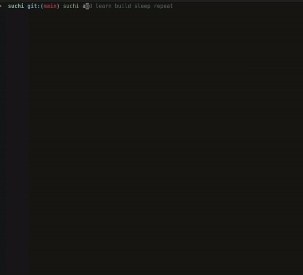

# suchi



##### [Note: The code of Repo might be(is) not good because I'm learning Rust while creating this project so it's not good and I know it so use it on your own risk.]

suchi is your fast, simple, and efficient task organizer written in Rust!

### How to Use:
First, install [Rust](https://www.rust-lang.org/tools/install)
```
cargo install suchi
```
### Setup Locally

```
git clone https://github.com/user-64bit/suchi.git && cargo install
```

### Availabel Commands

```
- add [TASKs]
    Add a new task/tasks to your list.
    Examples: 
	suchi add "Take a break and stretch" "Watch Next Episode of One Peace"
			OR
	suchi add bat ball cat apple

- edit [INDEX] [UPDATED TASK]
    Update an existing task by its index.
    Example: suchi edit 1 "Skip the break, let's push forward!"

- show
    Display all your tasks.
    Example: suchi show

- done [INDEXs]
    Mark a task/tasks as complete by its index.
    Example: suchi done 1 2 (marks the first and second tasks as completed)

- undone [INDEXs]
    Mark a task/tasks as complete by its index.
    Example: suchi undone 1 2 (marks the first and second tasks as completed)

- delete [INDEXs]
    Remove a task/tasks by its index.
    Example: suchi delete 4 5 (removes the fourth and fifth task)

- clear
    Remove all tasks in one go.
    Example: suchi clear

```